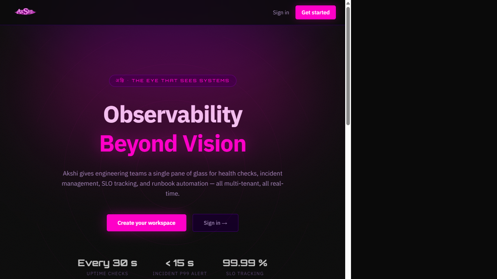
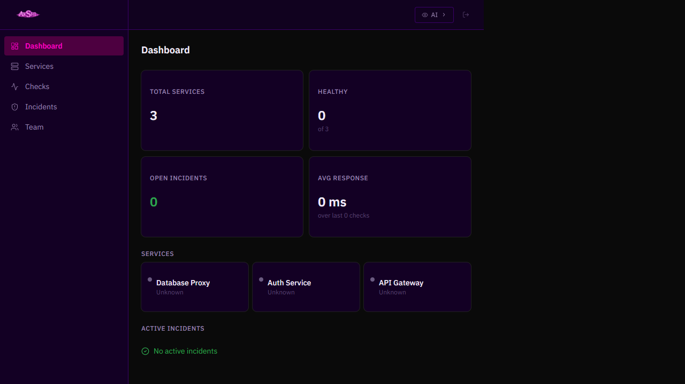
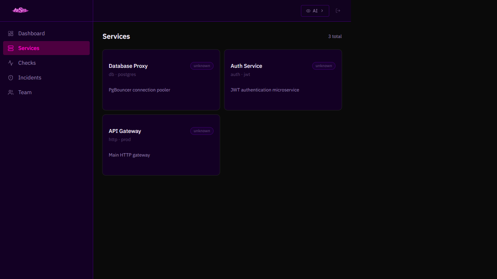
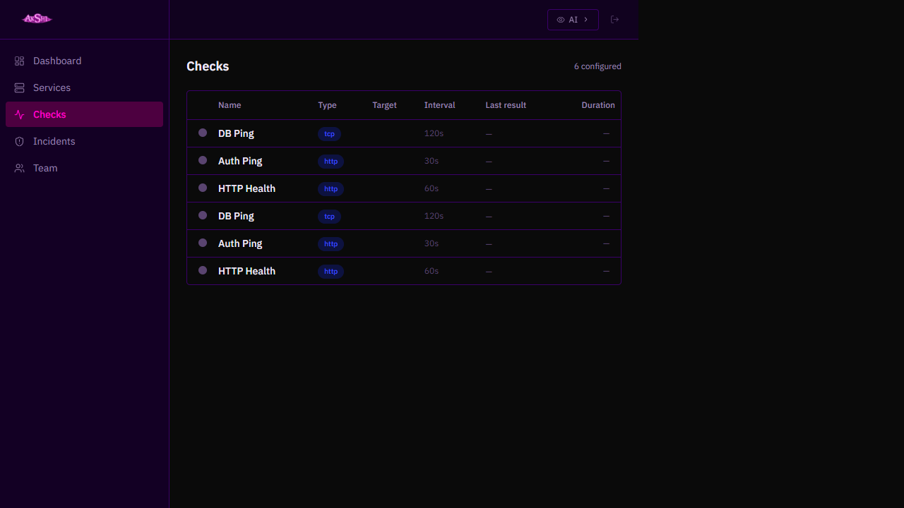
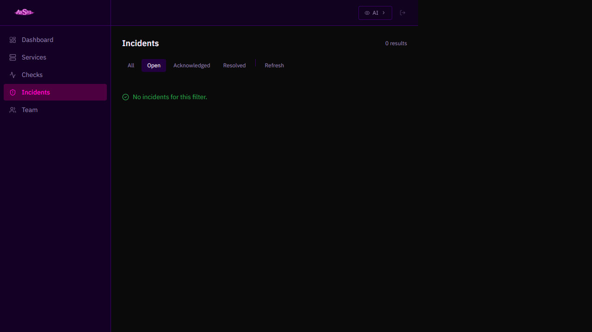
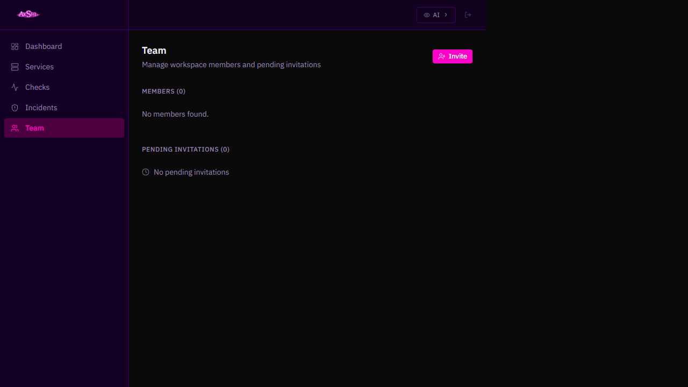

# Akshi — Observability Beyond Vision

> **The Eye That Sees Systems** — A multi-tenant SaaS monitoring platform for engineering teams.  
> Real-time uptime checks, incident management, SLO tracking and team collaboration in a single pane of glass.

---

## Table of Contents

1. [Overview](#1-overview)
2. [Design System](#2-design-system)
3. [Architecture](#3-architecture)
4. [Prerequisites](#4-prerequisites)
5. [Local Setup](#5-local-setup)
6. [Seed Demo Data](#6-seed-demo-data)
7. [Pages Walkthrough](#7-pages-walkthrough)
8. [API Reference](#8-api-reference)
9. [Tenant Architecture](#9-tenant-architecture)
10. [Proxy Fix — How it works](#10-proxy-fix--how-it-works)
11. [Known Limitations](#11-known-limitations)

---

## 1. Overview

Akshi is a **multi-tenant** observability platform where each organisation (tenant) gets its own isolated PostgreSQL schema via **django-tenants**. It provides:

| Feature | Description |
|---|---|
| **Uptime Checks** | HTTP, TCP, ICMP and Cron health checks with configurable intervals |
| **Incident Management** | Auto-open/acknowledge/resolve workflow with severity levels |
| **SLO Tracking** | Target uptime % per service |
| **Team Management** | Role-based access (Admin / Operator / Viewer) + email invitations |
| **Real-time Dashboard** | Stats aggregation: total services, healthy count, open incidents, avg response time |

---

## 2. Design System

### Palette — *Violet Galactique*

| Token | Value | Usage |
|---|---|---|
| `surface` | `#3B006A` | Cards, sidebar, nav |
| `accent` | `#FF00C8` | CTA buttons, active nav item, highlights |
| `background` | `#0A0015` | Page background |
| `text-primary` | `#F5E6FF` | Body text |
| `text-muted` | `#9370BB` | Labels, secondary text |

### Typography

- **Orbitron** — stat values, hero taglines, brand titles
- **IBM Plex Sans** — all body text, labels, forms

### Motion

All page transitions use **Framer Motion** `fadeUp` variants:

```ts
const fadeUp = {
  hidden: { opacity: 0, y: 24 },
  visible: { opacity: 1, y: 0, transition: { duration: 0.45, ease: "easeOut" as const } }
};
```

### Visual Motifs

- `CosmicGrain` — SVG turbulence noise overlay on landing page
- `ConcentricWaves` — SVG radial ring animation, hero background
- Magenta smoke blur (`radial-gradient` + `blur-3xl`) behind hero CTA
- Magenta bottom border on topbar (`border-b border-[#FF00C8]/30`)

---

## 3. Architecture

```
┌─────────────────────────────────────────────────┐
│  Browser  acme2.localhost:3003                  │
│  ┌────────────────────────────────────────────┐ │
│  │  Next.js 15 (App Router, React 19)         │ │
│  │  src/app/api/[...proxy]/route.ts  ──────┐  │ │
│  └──────────────────────────────────────── │ ─┘ │
└──────────────────────────────────────────── │ ──┘
                                              │ X-Forwarded-Host: acme2.localhost
                                              ▼
┌─────────────────────────────────────────────────┐
│  Django 5.2  127.0.0.1:8000                     │
│  django-tenants → schema: acme2                 │
│  DRF + SimpleJWT                                │
└─────────────────────────────────────────────────┘
                                              │
                                              ▼
┌─────────────────────────────────────────────────┐
│  PostgreSQL — schema per org                    │
│  Redis — Celery task queue                      │
└─────────────────────────────────────────────────┘
```

**Stack:**

| Layer | Technology |
|---|---|
| Frontend | Next.js 15, React 19, TypeScript, Tailwind CSS v4, shadcn/ui, @tanstack/react-query |
| Backend | Django 5.2, Django REST Framework, django-tenants |
| Auth | SimpleJWT (15-min access tokens) |
| Database | PostgreSQL (schema-per-tenant) |
| Cache / Queue | Redis + Celery |

---

## 4. Prerequisites

- **Node.js** ≥ 20
- **Python** ≥ 3.11
- **PostgreSQL** running locally
- **Redis** running on `localhost:6379`
- Git

---

## 5. Local Setup

### 5.1 Start Redis

**Windows:**
```powershell
Start-Process 'C:\Program Files\Redis\redis-server.exe' -WindowStyle Hidden
```

**macOS / Linux:**
```bash
redis-server --daemonize yes
```

### 5.2 Start Django Backend

```bash
cd backend

# Create virtual environment (first time only)
python -m venv .venv
source .venv/bin/activate        # macOS/Linux
.venv\Scripts\activate           # Windows

# Install dependencies (first time only)
pip install -r requirements.txt

# Apply migrations (first time only)
python manage.py migrate_schemas --shared

# Run dev server
DJANGO_SETTINGS_MODULE=sentinelops.settings.development python manage.py runserver
```

Django listens on `http://127.0.0.1:8000`.

### 5.3 Start Next.js Frontend

```bash
cd frontend
npm install          # first time only
npm run dev -- --port 3003
```

Frontend listens on `http://localhost:3003`.

### 5.4 Configure your hosts file

Add this line to `C:\Windows\System32\drivers\etc\hosts` (Windows) or `/etc/hosts` (macOS/Linux):

```
127.0.0.1   acme2.localhost
```

This allows the browser to reach your tenant at `http://acme2.localhost:3003`.

### 5.5 Create a tenant (first time only)

```bash
# From the backend directory, with venv active
python manage.py shell
```

```python
from django_tenants.utils import schema_context
from apps.tenants.models import Tenant, Domain

t = Tenant(schema_name="acme2", name="Acme Corp 2")
t.save(verbosity=0)
d = Domain(domain="acme2.localhost", tenant=t, is_primary=True)
d.save()
```

Or use the onboarding UI at `http://localhost:3003` → **Create your workspace**.

### 5.6 Login

Navigate to `http://acme2.localhost:3003/login` and enter your credentials.

> ⚠️ JWT access tokens expire after **15 minutes**. If the dashboard shows errors, simply sign out and sign back in.

---

## 6. Seed Demo Data

Use the following curl commands to populate your tenant with sample services and checks.  
Replace `TOKEN` with a valid JWT from `/api/v1/auth/login`.

```bash
# 1. Login and capture token
TOKEN=$(curl -s -X POST http://localhost:8000/api/v1/auth/login \
  -H "Content-Type: application/json" \
  -H "Host: acme2.localhost" \
  -d '{"email":"john@acme2.com","password":"secret123"}' \
  | grep -o '"access_token":"[^"]*"' | cut -d'"' -f4)

# 2. Create services
SVC1=$(curl -s -X POST http://localhost:8000/api/v1/services \
  -H "Content-Type: application/json" \
  -H "Host: acme2.localhost" \
  -H "Authorization: Bearer $TOKEN" \
  -d '{"name":"API Gateway","description":"Main HTTP gateway","tags":["http","prod"],"status":"active"}' \
  | grep -o '"id":"[^"]*"' | head -1 | cut -d'"' -f4)

SVC2=$(curl -s -X POST http://localhost:8000/api/v1/services \
  -H "Content-Type: application/json" \
  -H "Host: acme2.localhost" \
  -H "Authorization: Bearer $TOKEN" \
  -d '{"name":"Auth Service","description":"JWT authentication microservice","tags":["auth","jwt"],"status":"active"}' \
  | grep -o '"id":"[^"]*"' | head -1 | cut -d'"' -f4)

SVC3=$(curl -s -X POST http://localhost:8000/api/v1/services \
  -H "Content-Type: application/json" \
  -H "Host: acme2.localhost" \
  -H "Authorization: Bearer $TOKEN" \
  -d '{"name":"Database Proxy","description":"PgBouncer connection pooler","tags":["db","postgres"],"status":"active"}' \
  | grep -o '"id":"[^"]*"' | head -1 | cut -d'"' -f4)

# 3. Create checks
curl -s -X POST "http://localhost:8000/api/v1/services/$SVC1/checks" \
  -H "Content-Type: application/json" -H "Host: acme2.localhost" -H "Authorization: Bearer $TOKEN" \
  -d '{"name":"HTTP Health","check_type":"http","target":"https://api.acme2.com/health","config":{"expected_status":200},"interval_seconds":60,"retry_count":3,"is_enabled":true}'

curl -s -X POST "http://localhost:8000/api/v1/services/$SVC2/checks" \
  -H "Content-Type: application/json" -H "Host: acme2.localhost" -H "Authorization: Bearer $TOKEN" \
  -d '{"name":"Auth Ping","check_type":"http","target":"https://auth.acme2.com/ping","config":{"expected_status":200},"interval_seconds":30,"retry_count":2,"is_enabled":true}'

curl -s -X POST "http://localhost:8000/api/v1/services/$SVC3/checks" \
  -H "Content-Type: application/json" -H "Host: acme2.localhost" -H "Authorization: Bearer $TOKEN" \
  -d '{"name":"DB Ping","check_type":"tcp","target":"db.acme2.com:5432","config":{"timeout_ms":1000},"interval_seconds":120,"retry_count":1,"is_enabled":true}'
```

---

## 7. Pages Walkthrough

### Landing Page



The public marketing page at `http://localhost:3003`.

- **Hero**: "Observability Beyond Vision" with magenta animated CTA
- **Stats bar**: Every 30s checks · < 15s incident alert · 99.99% SLO tracking  
- **Features grid**: Uptime, Incidents, Team, SLO cards with animated icons

---

### Login


Multi-tenant login at `http://<slug>.localhost:3003/login`.

- Accepts email + password
- Returns JWT stored in `localStorage` under key `sentinel_access`
- On success: redirects to `/dashboard`

---

### Dashboard



Main overview at `/dashboard`.

**Stat cards:**
- **Total Services** — count of all registered services
- **Healthy** — services with last check status `ok` (shown as `X of N`)
- **Open Incidents** — count of incidents in `open` state
- **Avg Response** — mean duration_ms across the last 50 check results

**Services grid:** Each card shows service name + last known status badge.

**Active Incidents:** Table of open/acknowledged incidents with severity, opened-at, and acknowledge/resolve actions.

---

### Services



Full service catalogue at `/services`.

Each row shows: name, description, tags, check count, open incidents, status badge.

---

### Checks



All configured health checks at `/checks`.

Table columns: Name · Type (http/tcp/ping/cron) · Target · Interval · Last result · Duration.

---

### Incidents



Incident timeline at `/incidents`. Supports filtering by state (open / acknowledged / resolved).

Actions available: **Acknowledge** (with note) and **Resolve**.

---

### Team



Member and invitation management at `/team`.

- View all workspace members with their roles
- Invite new members by email with a role (Admin / Operator / Viewer)
- Cancel pending invitations or remove members

---

## 8. API Reference

All API endpoints are prefixed with `/api/v1/`. Authentication via `Authorization: Bearer <token>`.

| Method | Path | Description |
|---|---|---|
| `POST` | `/auth/login` | Login, returns `access_token` |
| `GET` | `/services` | List services (paginated) |
| `POST` | `/services` | Create a service |
| `GET` | `/services/:id/checks` | List checks for a service |
| `POST` | `/services/:id/checks` | Create a check |
| `GET` | `/checks` | List all checks across all services |
| `GET` | `/results/recent?limit=N` | Recent check results |
| `GET` | `/incidents` | List incidents (optional `?state=open`) |
| `POST` | `/incidents/:id/acknowledge` | Acknowledge an incident |
| `POST` | `/incidents/:id/resolve` | Resolve an incident |
| `GET` | `/team/members` | List workspace members |
| `DELETE` | `/team/members/:id` | Remove a member |
| `GET` | `/team/invitations` | List pending invitations |
| `POST` | `/team/invitations` | Send an invitation |
| `DELETE` | `/team/invitations/:id` | Cancel an invitation |
| `POST` | `/onboarding/create-org` | Create a new tenant + admin user |

---

## 9. Tenant Architecture

Akshi uses **django-tenants** with a PostgreSQL schema per organisation.

```
public schema  →  shared tables (tenants, domains, users)
acme2 schema   →  tenant tables (services, checks, incidents, team, ...)
acme3 schema   →  tenant tables (isolated)
```

**How tenant resolution works in production:**
1. User navigates to `acme2.myapp.com`
2. Browser sends `Host: acme2.myapp.com`
3. django-tenants looks up this domain in the `public.tenants_domain` table
4. Sets `search_path = acme2` for the PostgreSQL connection
5. All subsequent queries run against the `acme2` schema

---

## 10. Proxy Fix — How it works

In local dev, the browser hits Next.js at `acme2.localhost:3003`. When Next.js proxied requests to Django using `rewrites()`, it sent `Host: localhost:8000`, losing the tenant subdomain information.

**Fix implemented:**

1. Created `src/app/api/[...proxy]/route.ts` — a catch-all Next.js Route Handler that:
   - Strips the port from the incoming `Host` header: `acme2.localhost:3003` → `acme2.localhost`
   - Forwards it as `X-Forwarded-Host: acme2.localhost` to Django
   - Proxies all other headers (Authorization, Content-Type, Cookie)

2. Added `USE_X_FORWARDED_HOST = True` to `sentinelops/settings/development.py` so Django trusts the `X-Forwarded-Host` header.

3. Removed the conflicting `rewrites()` rule from `next.config.ts` so the Route Handler takes exclusive control.

```
Browser → Next.js proxy → X-Forwarded-Host: acme2.localhost → Django → schema: acme2 ✓
```

---

## 11. Known Limitations

| Limitation | Notes |
|---|---|
| JWT expires in 15 min | Re-login required after expiry. Refresh token flow not yet implemented in the UI. |
| Check runner not running | Celery workers need to be started separately for checks to actually execute. Services show "unknown" status until a check runs. |
| No status page | Public status page per tenant not yet built. |
| No 2FA | Single-factor auth only. |
| `localhost` subdomain routing | Requires a `/etc/hosts` entry or a wildcard DNS tool like `dnsmasq`. |

---

## Starting all services (quick reference)

```bash
# Terminal 1 — Redis
Start-Process 'C:\Program Files\Redis\redis-server.exe' -WindowStyle Hidden

# Terminal 2 — Django
cd backend && .venv\Scripts\activate
DJANGO_SETTINGS_MODULE=sentinelops.settings.development python manage.py runserver

# Terminal 3 — Next.js
cd frontend && npm run dev -- --port 3003
```

Then open `http://acme2.localhost:3003` in your browser.

---

*Built with ♥ — Akshi · Violet Galactique design system*
